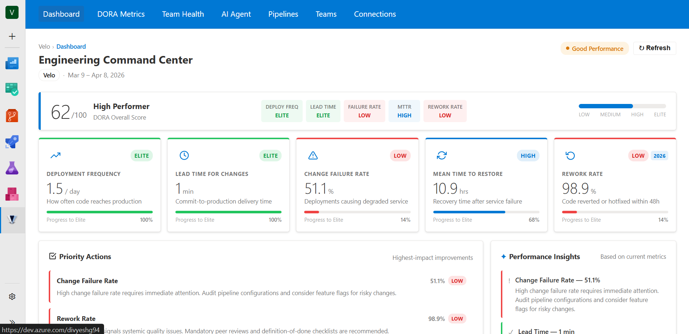
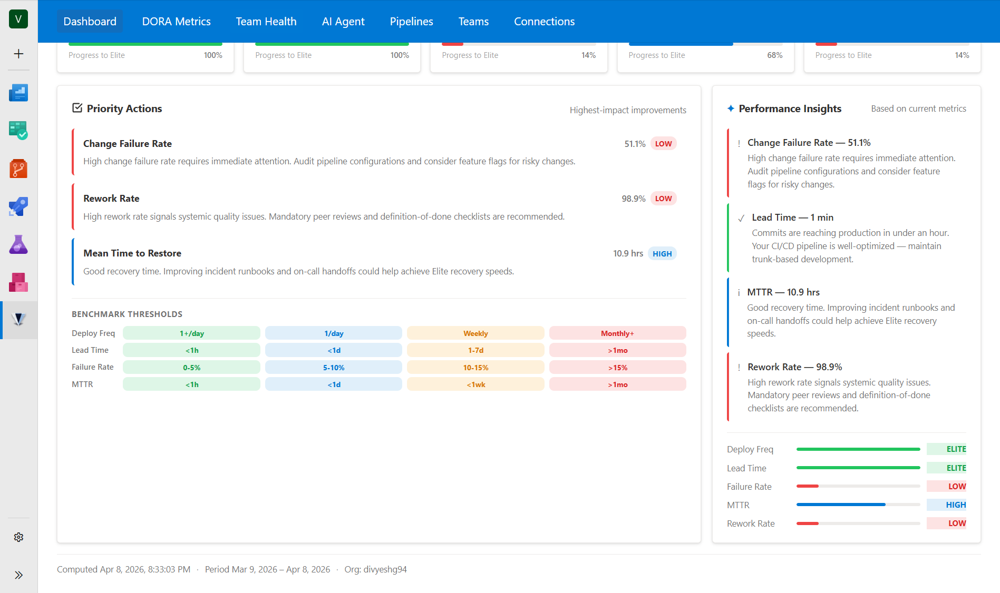
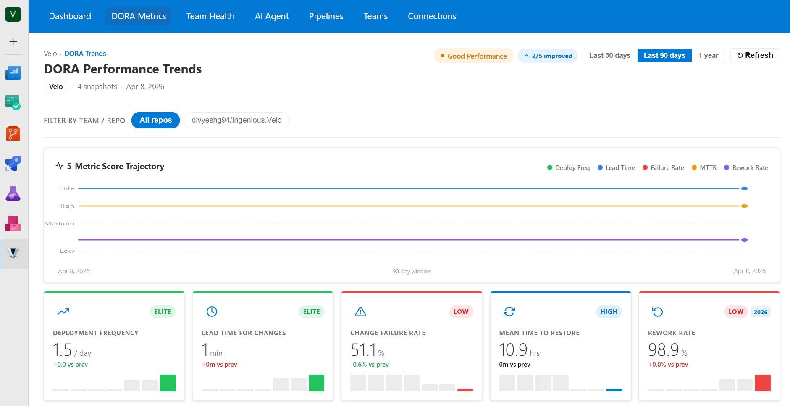
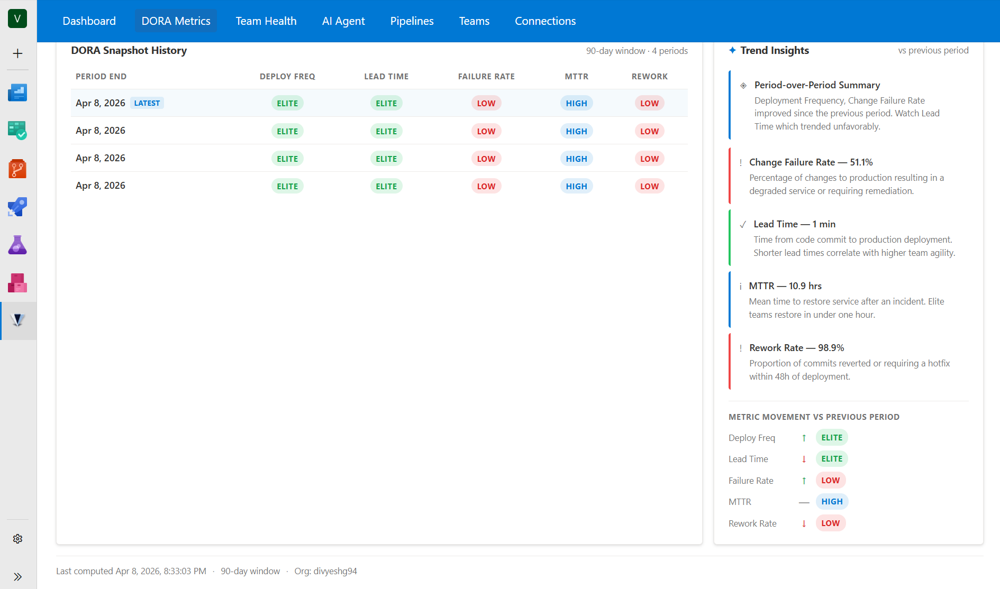
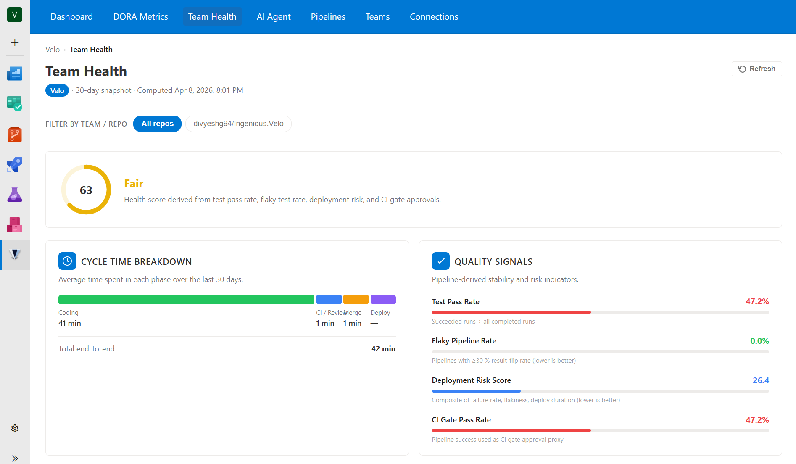
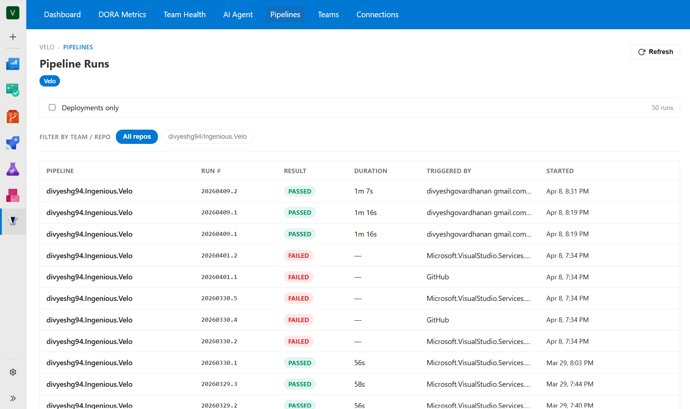
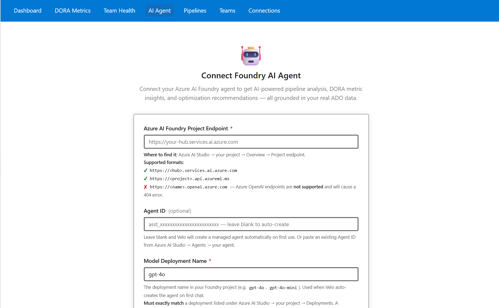
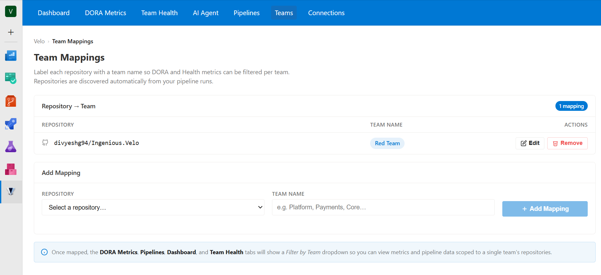
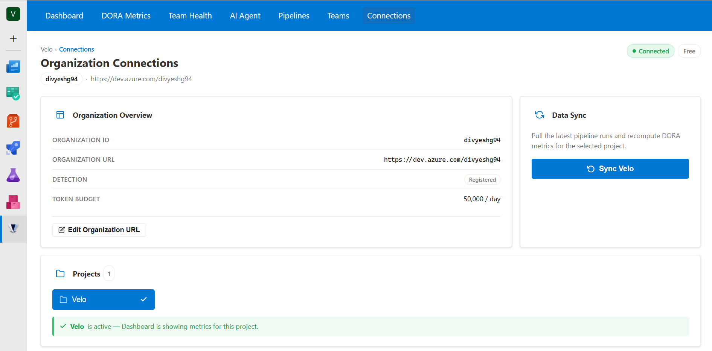
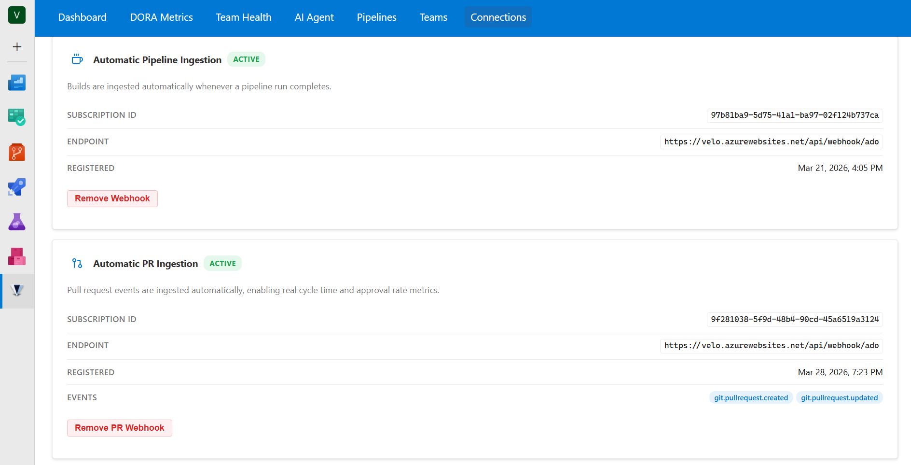

# Velo

**AI-Powered DORA Metrics, Pipeline Analytics, and Engineering Intelligence for Azure DevOps**

[](https://github.com/divyeshg94/Ingenious.Velo/actions/workflows/ci.yml)
[](https://marketplace.visualstudio.com/items?itemName=IngeniousLabs.velo)
[](LICENSE)
[](https://dotnet.microsoft.com)
[](https://nodejs.org)

Velo gives engineering managers and development teams instant visibility into how software is actually being delivered. It automatically tracks all five DORA metrics — including the 2026 Rework Rate — directly from your Azure DevOps pipelines and pull requests, with no manual tagging or custom scripts required. When you need to go deeper, the built-in Pipeline Intelligence Agent (powered by Microsoft Foundry + GPT-4o) answers questions about your delivery health in plain language, right inside Azure DevOps.

Built on **Microsoft Foundry** + **Azure PaaS**. Native Azure DevOps extension — one-click install, zero configuration.

**[Install from the Visual Studio Marketplace →](https://marketplace.visualstudio.com/items?itemName=IngeniousLabs.velo)**

---

## Screenshots

<table>
  <tr>
    <td></td>
    <td></td>
  </tr>
  <tr>
    <td></td>
    <td></td>
  </tr>
  <tr>
    <td></td>
    <td></td>
  </tr>
  <tr>
    <td></td>
    <td></td>
  </tr>
  <tr>
    <td></td>
    <td></td>
  </tr>
</table>

---

## Features

### DORA Metrics (all 5, including 2026 Rework Rate)
- **Deployment Frequency** — auto-detected from YAML stage names and environment tags
- **Lead Time for Changes** — PR merge-to-deploy time, no manual tagging
- **Change Failure Rate** — computed from failed / rolled-back pipeline runs
- **Mean Time to Restore** — measured from failure detection to successful re-deploy
- **Rework Rate** *(2026)* — work-item churn detected via ADO work item events

### Pipeline Intelligence Agent
- Conversational chat powered by **Microsoft Foundry** + **GPT-4o**
- Answers questions about pipeline bottlenecks, team health, and delivery trends
- Responses cached per pipeline fingerprint — no redundant AI calls
- Token-budgeted: 50,000 input tokens / org / day on the free tier

### Azure DevOps Native
- **Project Hub** — full metrics dashboard + agent chat in the left nav
- **Dashboard Widgets** — compact DORA tiles for any ADO dashboard
- **`Velo@1` Pipeline Task** — optional instrumentation step in YAML pipelines
- One-click install from the Visual Studio Marketplace; no infrastructure required for end users

---

## Tech Stack

| Layer | Technology |
|---|---|
| Extension UI | Angular 19 + VSS SDK 2.0 |
| API | ASP.NET Core 9 on Azure Container Apps |
| AI Agent | Microsoft Foundry (Azure AI Agents) + GPT-4o |
| Database | Azure SQL Serverless + EF Core 9 |
| Auth | Azure AD B2C + ADO OAuth (Managed Identity, no secrets in code) |
| IaC | Bicep (dev / staging / prod params) |
| CI/CD | GitHub Actions |

---

## Architecture

```
VS Marketplace CDN          Azure PaaS (your subscription)
┌──────────────────┐        ┌─────────────────────────────┐
│  Angular 19      │◄──────►│  ASP.NET Core 9 API         │
│  Extension UI    │  Auth   │  Azure Web Apps       │
└──────────────────┘  B2C   │  WebhookController (ADO)    │
                            ├─────────────────────────────┤
Azure DevOps ──────────────►│  Azure SQL Serverless        │
 (service hooks)            │  Row-level security (RLS)    │
                            ├─────────────────────────────┤
                            │  Microsoft Foundry Agent     │
                            │  GPT-4o (cached by pipeline) │
                            └─────────────────────────────┘
```

---

## Quick Start

### Install from Marketplace

1. Go to your Azure DevOps organization → **Organization Settings → Extensions**
2. Search for **Velo** or install directly from the [Visual Studio Marketplace](https://marketplace.visualstudio.com/items?itemName=IngeniousLabs.velo)
3. The Velo tab appears in every project's left navigation immediately

### Deploy Your Own Backend (Enterprise / Self-Hosted)

See [docs/extension/self-host-backend.md](docs/extension/self-host-backend.md)

---

## Local Development

### Prerequisites

| Tool | Version |
|---|---|
| .NET SDK | 9.x |
| Node.js | 20.x |
| Azure CLI | latest |
| Docker | latest (for local SQL Server) |

### Setup

```bash
# Clone
git clone https://github.com/divyeshg94/Ingenious.Velo.git
cd Ingenious.Velo

# Backend — restore, build, run
dotnet restore
dotnet build
cd src/Velo.Api && dotnet run

# Extension — separate terminal
cd src/Velo.Extension
npm install
npm start
```

### Local Database

```bash
# Start SQL Server via Docker
docker run -e "ACCEPT_EULA=Y" -e "SA_PASSWORD=Velo@Dev123" \
  -p 1433:1433 --name velo-sql \
  -d mcr.microsoft.com/mssql/server:2022-latest

# Apply migrations (repeat for 002–015)
sqlcmd -S localhost -U sa -P Velo@Dev123 -d master \
  -i db/migrations/001_initial_schema.sql
```

### Secrets

Use `dotnet user-secrets` — never commit connection strings:

```bash
cd src/Velo.Api
dotnet user-secrets set "ConnectionStrings:VeloDb" "Server=localhost;Database=VeloDev;..."
```

For the full dev environment walkthrough see [docs/contributing/local-setup.md](docs/contributing/local-setup.md).

---

## Repository Structure

```
Ingenious.Velo/
├── src/
│   ├── Velo.Extension/     # Angular 19 ADO Extension
│   ├── Velo.Api/           # ASP.NET Core 9 REST API
│   ├── Velo.Agent/         # Microsoft Foundry AI Agent
│   ├── Velo.SQL/           # EF Core DbContext + migrations
│   └── Velo.Shared/        # Shared models and contracts
├── infra/                  # Bicep IaC (dev/staging/prod)
├── db/migrations/          # SQL migrations (001–015)
└── docs/                   # Architecture, API, and dev docs
```

---

## Roadmap

### Implemented

| Area | Details |
|---|---|
| DORA Metrics | All 5 metrics computed from ADO webhook events (build, PR, work item) |
| Data Ingestion | Webhook handler + manual sync for build / PR / work-item events |
| Multi-Tenant Security | SQL RLS + EF Core query filters + tenant middleware |
| AI Agent | Foundry SDK agent with pipeline, code, and recommendation analysis tools |
| Agent Configuration | API key, service principal, or Managed Identity — configured in the UI |
| Team Health | Pipeline stability scores per team and repository |
| Angular Extension | Project Hub, Dashboard Widget, Pipeline Task — all tabs wired to live API |
| Database | 15 SQL migrations, EF Core 9, row-level security hardening |

### Up Next

| Area | Notes |
|---|---|
| Azure Functions | Background ingestion worker + DORA timer-triggered compute function |
| Metric refinements | Increased token-count accuracy and rate-limit tuning |
| Performance & scale | Query optimisation for large organisations |

### Future

| Phase | Focus |
|---|---|
| Community & IaC | HashiCorp Terraform provider, community contribution tooling |
| Enterprise Self-Hosted | Customer-deployed backend via Bicep template |

---

## Contributing

Contributions are welcome. Please read [CONTRIBUTING.md](CONTRIBUTING.md) first, then:

1. Fork the repo and create a branch: `git checkout -b feature/your-feature`
2. Follow the [coding standards](docs/contributing/coding-standards.md) and [testing guide](docs/contributing/testing-guide.md)
3. Ensure CI passes: `dotnet test` and `npm test`
4. Open a PR against `master` with a clear description of what and why

For larger changes, open an issue first to align on the approach.

---

## Acknowledgements

- [Microsoft Foundry / Azure AI Agents](https://learn.microsoft.com/azure/ai-services/agents/) — agent orchestration
- [Azure DevOps Extension SDK](https://github.com/microsoft/azure-devops-extension-sdk) — extension host integration
- [Angular](https://angular.dev), [ASP.NET Core](https://dotnet.microsoft.com/apps/aspnet), [EF Core](https://learn.microsoft.com/ef/core/) — application frameworks

---

## License

MIT — see [LICENSE](LICENSE)
